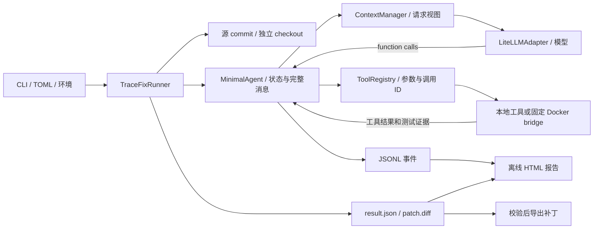

# TraceFix 面向外部使用的系统审查

代码身份：本批起点 `b375b9efadc93dad2d3d2fc543cce2f50a293628`。下表的“源码”表示已核对调用链；“历史 CI”是相应旧提交的证据，不替代本批验证。新增普通仓库路径的本轮原始结果与最终提交见本批开发记录。

| 用户场景 | 入口与配置 | 正常路径 | 证据 | 缺口与优先级 |
| --- | --- | --- | --- | --- |
| 模型驱动修复 | `tracefix run` → `RunConfig` → LiteLLM；`--model`/环境 | Runner 构造适配器并进入 Agent loop | 源码；历史真实运行，当前提交无付费新调用 | 当前真实模型端到端仍待授权核查；P1 |
| function calling | `MinimalAgent.step` → `ToolRegistry` → 五工具；ToolSpec schema | 多调用逐项执行，ToolResult 按 call ID 返回 | 源码、既有 fixture | 客户端超时后副作用是否发生不能从协议推断，恢复不得重放未知调用；P1 |
| 上下文选择 | `ContextManager`；`AgentConfig.context` | 完整消息历史与模型请求视图分离，长工具结果裁剪，旧批次折叠 | 源码、长上下文 fixture | 摘要不是长期任务记忆；估算不等于供应商 usage；P1 |
| Skills | `--skills`、`load_skill`、包内技能目录 | 本地及 Docker bridge 均注册工具，按需载入正文和参考 | 源码、分页 Skills-only 与 Linux CI | 普通真实模型触发和用户自定义审核目录未验证；P2 |
| 本地执行 | `--repo`、`--test-python`、`--test-target`、`--source-import` | 干净源码克隆、导入探针、pytest、补丁及 Diff | 源码、本批定向测试 | 本地代码执行需信任仓库；复杂构建有限支持；P0 |
| Docker 执行 | `--execution-backend docker` | 固定任务镜像与 JSONL bridge | Linux CI 固定案例 | 普通仓库镜像和权限契约尚无；P2 |
| 预算与停止 | CLI 预算、Adapter timeout、AgentState | 请求前及响应后检查，保存终态 | 源码、既有预算测试 | 未知费用和 token 估算必须分别呈现；P1 |
| 持久化与恢复 | `result.json`、`trajectory.jsonl`、`patch.diff` | Runner finally 保存结果和 Diff | 源码、历史演示 | 没有会话 checkpoint；旧轨迹不能直接恢复工具去重及预算；P1 |
| 报告与导出 | `tracefix report`、`tracefix export` | 从保存证据生成 HTML，校验补丁哈希后导出 | 源码、本批测试 | 无独立验收时明确缺失；历史补丁无哈希，只能核对路径及源码提交；P0 |

数据流：CLI 解析配置并进行零调用预检；Runner 固定源 commit，创建独立工作副本和工具注册表；Agent 维护完整消息与状态，经 ContextManager 构造请求视图；模型返回工具调用，ToolRegistry 执行并把结构化结果加入历史；Runner 将轨迹、最终状态和 Diff 保存，报告与导出只读取保存产物。

边界检查：`ToolSpec` 要求对象 JSON schema，内置工具再用 Pydantic 验证参数；`MessageHistory` 检查调用 ID 配对。`MinimalAgent.step` 按响应顺序执行多个调用，预算/时间中断时给未执行调用补结构化失败结果；未知工具与工具异常进入失败结果，返回 ID/工具名不匹配会被拒绝。读工具有成功结果去重，失败的同一补丁也有去重；但进程在副作用调用后、结果保存前崩溃时，不能确定是否执行过，因此下批 checkpoint 必须停在未知结果并要求复核。现有代表性测试包括 `tests/test_minimal_agent.py` 的未知工具恢复及未执行调用配对、`tests/test_builtin_tools.py` 的测试超时/证据校验、`tests/test_skills.py` 的加载去重和字节预算。本批新增普通仓库回放覆盖实际测试失败、补丁、复测及导出；上述历史测试的本批全量结果以工程记录为准。

上游参考以官方源码为准，`git ls-remote` 在审查时固定了以下 `main` 提交，**本批没有复制其代码或引入依赖**：[mini-swe-agent 的循环及逐步保存](https://github.com/SWE-agent/mini-swe-agent/blob/04d809ceab9df28f9adaed044884180159172930/src/minisweagent/agents/default.py)、[OpenHands SDK 状态持久化](https://github.com/OpenHands/software-agent-sdk/blob/978f3b46130416528fd076628ef685343819f05c/openhands-sdk/openhands/sdk/conversation/state.py)、[Aider 历史摘要](https://github.com/Aider-AI/aider/blob/5dc9490bb35f9729ef2c95d00a19ccd30c26339c/aider/history.py)、[Serena MCP 工具包装](https://github.com/oraios/serena/blob/7a2968335f2198b966864de1ce3655c8e485a653/src/serena/mcp.py)。首批借鉴可检查的逐步轨迹和分离状态的思想，保持当前工具协议与确定性压缩，不增加模型摘要费用。下批引入 SDK 或服务前仍需固定 release、许可证及依赖哈希。

| 项目 | 具体机制解决的问题 | TraceFix 最小取法、成本与不采用项 |
| --- | --- | --- |
| mini-swe-agent | loop 每步保存轨迹，使异常前的执行过程可追溯 | 保留现有 JSONL 事件，下一批在完整工具批次后保存 checkpoint；需维护状态版本。其单命令行动接口不能覆盖现有五工具的参数和测试证据契约。 |
| OpenHands SDK | 会话基础状态与事件分离持久化，可恢复对话与工具定义 | 借鉴状态快照加事件身份校验；迁移需处理源码、预算和未知工具结果。完整服务/工作区体系维护成本超出首批。 |
| Aider | 近期上下文保留、早期摘要降低长对话输入 | TraceFix 继续用确定性摘要和完整历史；模型摘要会增加请求费用，并可能改写测试证据，当前不采用。 |
| Serena | 绑定项目并提供符号与引用查询，补文本搜索无法直接回答的引用问题 | 后续独立只读 MCP sidecar；要维护隔离、版本和 LSP 依赖，且工具注解不等于文件权限边界，本批不接入。 |
